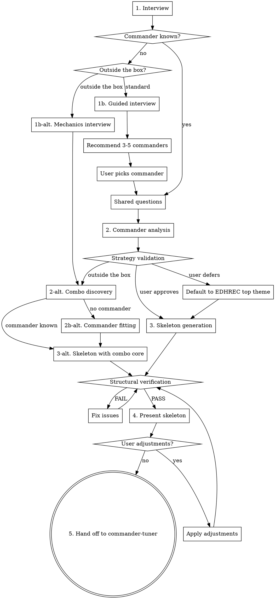

# Commander Deck Builder

## Overview

Structured process for building an MTG Commander deck from scratch. Guides the user through commander selection, preference gathering, and skeleton generation, then hands off to commander-tuner for refinement.

Every card recommendation MUST be grounded in actual card oracle text from Scryfall — never from training data.

## The Iron Rule

**NEVER assume what a card does.** Before including any card in the skeleton, look up its oracle text via the helper scripts. Training data is not oracle text.

**Exception:** During commander *discovery* (recommending commanders to a user who doesn't know what to build), you may use training data to generate a shortlist of candidates. But every recommended commander MUST be verified before presenting — write all candidate names to a JSON list and batch-lookup in one call: `uv run --directory <skill-install-dir> scryfall-lookup --batch <candidates.json> --bulk-data <bulk-data-path> --cache-dir <skill-install-dir>/.cache`.

## Setup (First Run)

Before first use, set up the Python environment from the skill's install directory:

```bash
uv sync --directory <skill-install-dir>
```

Then download Scryfall bulk data (~500MB):

```bash
uv run --directory <skill-install-dir> download-bulk --output-dir <skill-install-dir>
```

Subsequent runs skip these steps if the `.venv` exists and bulk data is fresh (<24 hours old).

## Tooling Notes

**Writing JSON files with card names:** Card names often contain apostrophes (Azor's Elocutors, Krark's Thumb) which break shell quoting. Always use heredocs with single-quoted delimiters when writing JSON files via Bash:

```bash
cat > /tmp/candidates.json << 'JSONEOF'
["Azor's Elocutors", "Krark's Thumb", "Fire // Ice"]
JSONEOF
```

Do NOT use `echo` or unquoted shell strings for JSON containing card names. For the same reason, prefer Bash heredocs over the Write tool when creating temporary files in `/tmp` — the Write tool requires reading a file before writing to it, which fails for new files.

**Card count verification:** After writing or editing a deck text file by hand, always parse it immediately and verify the total card count matches the expected deck size (100 for Commander/Historic Brawl, 60 for Brawl). Off-by-one errors from manual edits are common and easy to miss.

## Workflow



## Step 1: Interview

### Commander Selection

Ask: "Do you know what commander you want to build a deck for?"

**If yes:**
- Take the commander name.
- Look up via `scryfall-lookup` to validate it exists.
- Verify it's a legal commander using Scryfall's `is:commander` filter (the source of truth for commander legality — don't try to reimplement the rules).
- For Brawl and Historic Brawl, also check that the card is legal in the deck's format using the Scryfall `legalities` field (key `standardbrawl` for Brawl, `brawl` for Historic Brawl).
- Check the commander's oracle text for partner, friends forever, or choose a background. If present, ask: "This commander supports a pairing — do you have a partner/background in mind, or would you like a recommendation?" Look up and validate the second commander the same way.
- For partner/background pairs, the deck's color identity is the combined identity of both commanders. Use the combined identity for all subsequent steps.
- Ask: "Want a standard build or go outside the box with unusual combos?"
  - **Standard:** Proceed to shared questions.
  - **Outside the box:** Proceed to shared questions, then follow the "Outside the Box" workflow (Step 2-alt) after commander analysis.

### Commander Selection from a Collection

**If the user provides a Moxfield CSV (or any deck-list export) of cards they own** and wants to pick a commander from what they already have, follow this exact procedure. Do NOT write ad-hoc Python that loads the file and calls `.get()` on it — the helper scripts already handle every step correctly.

This narrows the candidate *pool*; it does NOT replace the guided interview. Run the interview anyway — the answers drive ranking against the narrowed pool.

**Workflow:**

1. **Parse the collection** — `uv run --directory <skill-install-dir> parse-deck <absolute-path-to-collection.csv>` produces a parsed deck JSON. `parse-deck` already handles Moxfield CSV, Moxfield deck export, Arena, MTGO, and plain text — use it for any collection format the user gives you.

2. **Find commander candidates** — `uv run --directory <skill-install-dir> find-commanders <parsed.json> --bulk-data <bulk-data-path> --format <format> [--color-identity <ci>] [--min-quantity 1]`. Pass `--color-identity` only if the user has already stated a color preference; otherwise omit and narrow in step 4. Pass `--min-quantity 0` only if the user explicitly wants their wishlist/binder rows considered. The result is a JSON array of owned, format-legal, commander-eligible cards with per-card signals (`edhrec_rank`, `game_changer`, `is_partner`, `partner_with`, `has_background_clause`, `owned_quantity`, plus oracle text and the usual identification fields). The output already satisfies the Iron Rule — oracle text is from bulk data, not training data.

3. **Run the guided interview** (colors, playstyle, mechanics, favorite cards, play group, bracket, budget) the same as the no-collection flow. The candidate pool is the constraint; the interview answers are what differentiates one commander from another.

4. **Build a mixed shortlist of ~5 candidates**, weighted by interview answers. Do NOT just pick the 5 lowest `edhrec_rank` values — that produces boring recommendations. Aim for roughly:
   - **2 staples** — well-supported commanders (low `edhrec_rank`) that obviously fit the user's stated preferences. These exist to give the user a safe pick.
   - **2 off-meta picks** — commanders with higher or null `edhrec_rank` whose oracle text mechanically matches the interview answers (especially the mechanics question). These are usually the most interesting options.
   - **1 wildcard** — something the user probably hasn't considered: an unusual color combo they own, a partner pairing where they own both halves, or a commander that enables a combo using cards already in their collection.
   - For bracket gating, use the `game_changer` flag and your judgment about combo density. Do NOT use any "EDHREC bracket" field — community bracket data is user-reported and unreliable.

5. **Enumerate partner pairings from within the owned pool.** Walk the candidate list once: for each card with `is_partner=true`, find compatible partners from the same list (any other `is_partner=true` card; for `partner_with` cards, look for the named target). For each card with `has_background_clause=true`, find Backgrounds (`type_line` contains both "Legendary Enchantment" and "Background") in the candidate list. Surface promising pairings as wildcard or off-meta picks — "you already own both halves" is exactly the kind of non-obvious recommendation that makes a collection-aware flow feel useful. Skip pairings where the combined color identity doesn't match the user's stated colors.

6. **Present the shortlist** following the existing "Commander Recommendation" rules (verified oracle text from the script output, color identity, EDHREC count as one signal not the ranking, why-it's-on-the-list label of "staple" / "off-meta fit" / "wildcard"). Mention to the user that candidates are filtered to cards they own and that the default `--min-quantity 1` excludes any wishlist/binder rows — in case they expected to see something tracked at quantity 0. Let the user pick, then proceed to the standard shared questions and Step 2 (Commander Analysis).

### Format Selection

Ask: "What format are you building for?"

- **Commander/EDH** (default) — 100 cards, 40 life
- **Brawl** — 60 cards, Standard card pool, 25/30 life, no commander damage
- **Historic Brawl** — 100 cards (or 60 in paper), Arena/paper card pool, 25/30 life, no commander damage

**Arena naming confusion:** On MTG Arena, "Brawl" (the queue name) actually refers to Historic Brawl, and "Standard Brawl" refers to what we call Brawl. If a user says "I play Brawl on Arena," they almost certainly mean Historic Brawl. Clarify which they mean.

If Brawl or Historic Brawl: ask "Are you playing on Arena or in paper?"
- **Arena** locks deck size automatically: Standard Brawl is always 60 cards, Historic Brawl (called "Brawl" on Arena) is always 100 cards.
- **Paper Historic Brawl** only: ask if they want 100 or 60 cards.

If Brawl: any legendary planeswalker can be your commander (not just those with "can be your commander" text). Vehicles and Spacecraft with power/toughness are also eligible in all formats.

**Colorless commanders in Brawl:** If the chosen commander has no colors in its color identity, note that the deck may include any number of basic lands of one chosen basic land type. This is a Brawl-specific exception.

**Partner mechanics** are available in all formats.

**If no:** Ask: "Want to explore standard archetypes or go outside the box with unusual combos?"

- **Standard archetypes:** Continue with the guided interview below, then standard workflow.
- **Outside the box:** Skip to the "Outside the Box" workflow (Step 1b-alt) after format selection and shared questions.

**Guided Interview (one question at a time, for standard archetypes):**

1. **Colors** — "What colors do you enjoy playing? (Pick any combination, or 'no preference')"

2. **Playstyle** — "What's your preferred playstyle?" Present options with brief plain-language explanations so newer players can follow:
   - Aggro (attack fast and hard)
   - Combo (assemble card combinations that win the game)
   - Control (answer threats and win late)
   - Voltron (power up your commander for lethal damage)
   - Tokens (build a wide board of creature tokens)
   - Tribal (build around a creature type)
   - Midrange/Value (generate steady incremental advantage)
   - Group Hug/Politics (make allies, share resources, influence the table)

3. **Mechanics** — "Any specific mechanics you enjoy?" Offer examples with explanations: "+1/+1 counters (growing your creatures over time), theft (stealing opponents' cards), blink (flickering creatures to reuse their effects), spellslinger (casting lots of instants and sorceries), artifacts-matter, landfall (rewards for playing lands)." Open-ended. If the answer maps to multiple distinct sub-archetypes, ask one follow-up to disambiguate with explanations (e.g., "When you say graveyard, are you thinking more reanimator (bringing big creatures back from the dead), aristocrats (sacrificing creatures for value), or self-mill (filling your graveyard as a resource)?").

4. **Favorite cards/sets** — "Any favorite cards or recent sets that excited you? This helps me find commanders in a similar design space."

5. **Play group dynamics** — "How does your play group typically play? (casual/competitive, combo-heavy, creature-heavy, lots of interaction)"

6. **Bracket** — "What power bracket are you targeting? (1-4, or casual/mid/high/max)"

7. **Budget** — "What's your total budget for the deck? (dollar amount, or wildcard counts for Arena)"

### Commander Recommendation

After the guided interview, recommend 3-5 commanders that fit. Partner pairs and commander + background pairings are valid recommendations — present each pair as a single option with their combined color identity. You may use training data to generate a shortlist — this is commander *discovery*, not card evaluation, so the Iron Rule does not apply at this stage. However, every recommended commander MUST be verified via `scryfall-lookup` before presenting (to confirm it exists, is a legal commander, and its oracle text matches the claimed strategy). Check EDHREC deck counts where possible to gauge how well-supported each commander is.

Present each recommendation with:
- Card name and color identity
- Brief explanation of why it matches the user's preferences
- EDHREC deck count (if available) to indicate community support
- Any notable budget implications

Let the user pick.

### Shared Questions

Ask all of these (skipping any already answered during the guided interview):

- **Bracket:** "What power bracket are you targeting? (1-4, or casual/mid/high/max)"
- **Budget:** "What's your total budget for the deck? (dollar amount, or wildcard counts for Arena)"
- **Experience level:** "What's your Commander experience level? (beginner/intermediate/advanced)"
- **Pet cards:** "Any cards you definitely want included?" (pet cards, combos they want to build around)

For pet cards: write all pet card names to a JSON list and batch-lookup in one call: `uv run --directory <skill-install-dir> scryfall-lookup --batch <pet-cards.json> --bulk-data <bulk-data-path> --cache-dir <skill-install-dir>/.cache`. Verify each exists and is within the commander's color identity. Slot pet cards into the appropriate template categories — they count against those category budgets. If pet cards exceed ~10, warn the user that it limits the ability to build a balanced skeleton and ask if they want to trim. If a category overflows due to pet cards, shrink it and redistribute remaining slots.

## Step 2: Commander Analysis

1. **Scryfall lookup** — Run: `uv run --directory <skill-install-dir> scryfall-lookup "<Commander Name>"`

   Read the full oracle text, color identity, CMC, and types. For partner/background pairs, look up both commanders and note how they interact with each other.

2. **EDHREC research** — Run: `uv run --directory <skill-install-dir> edhrec-lookup "<Commander Name>"`

   For partner commanders: `uv run --directory <skill-install-dir> edhrec-lookup "<Commander 1>" "<Commander 2>"`

   Review top cards, high synergy cards, and themes. **Brawl/Arena note:** EDHREC data is sourced from Commander/EDH decks. For Brawl/Historic Brawl, EDHREC recommendations must be legality-checked against the deck's format before including. For Arena decks, also verify cards exist on Arena — some cards are legal in a format but have no Arena printing.

3. **Web research** — Use `WebSearch` for the commander + "deck tech", "strategy", "guide". Use `WebFetch` or the helper script to read strategy articles:

   Run: `uv run --directory <skill-install-dir> web-fetch "<url>" --max-length 10000`

4. **Strategy synthesis** — Summarize the commander's key mechanics, primary strategies, and synergy axes. For partner/background pairs, identify how both commanders contribute to the strategy and where their mechanics overlap or complement each other. Present to the user for validation. If the user defers or has no preference, default to the commander's most popular theme on EDHREC and move forward.

The goal is building enough understanding to make smart category fills — not deep analysis (commander-tuner handles that).

## Step 3: Skeleton Generation

### Default Template

Card counts scale with deck size. The base counts below are for 100-card decks; for 60-card decks, multiply each count by 0.6 and round to the nearest integer.

| Category | 100-card | 60-card | Notes |
|----------|----------|---------|-------|
| Commander(s) | 1-2 | 1-2 | Already selected |
| Lands | 36-38 | 22-23 | Burgess formula scaled: `round((31 + colors + cmc) * deck_size / 100)` |
| Ramp | 10 | 6 | Mana rocks, dorks, land-fetch spells |
| Card draw | 10 | 6 | Prefer draw that aligns with strategy |
| Targeted removal/disruption | 5-12 | 3-7 | Scaled to bracket |
| Board wipes | 2-5 | 1-3 | Scaled to bracket |
| Win conditions | 3-5 | 2-3 | Cards that close out a game |
| Engine/synergy pieces | 15-20 | 9-12 | Cards that work with the commander |
| Protection/utility | 8-10 | 5-6 | Counterspells, hexproof, recursion |

### Template Flexibility

The category counts above are defaults — adjust them after strategy validation to match the user's confirmed direction. Examples:

- **Voltron:** Increase protection/utility, shift engine slots toward equipment/auras
- **Combo:** Increase card draw and win conditions, add tutor slots
- **Aggro/tokens:** Reduce board wipes (they hurt you too), increase engine pieces
- **Control:** Increase interaction across the board, reduce engine pieces
- **Group hug/politics:** Reduce targeted removal, add political tools to utility

**Hard constraints that don't flex:** Lands and ramp stay at Burgess formula minimums regardless of strategy. Total card count must match the deck's expected size (100 for Commander/Historic Brawl, 60 for Brawl, or the user's specified size).

### Land Base Composition

The land count comes from the Burgess formula, but composition matters. Guidelines:

- **Basics:** Enough to be fetched by ramp spells (Cultivate, Kodama's Reach, etc.) and not punished by Blood Moon/Back to Basics. Mono/two-color decks lean heavier on basics.
- **Color fixing:** Scale to budget and color count:
  - **Budget ($25-75):** Gain lands, temples (scry lands), tri-lands, check lands, pain lands
  - **Mid ($75-200):** Add filter lands, battle lands, pathway lands, talismans
  - **High ($200+):** Shocks, fetches, original duals if budget allows
- **Arena wildcard tiers:** For Arena decks, ignore dollar tiers and budget by wildcard rarity:
  - **Tight on wildcards:** Lean on uncommon lands (gain lands, check lands, surveil lands, tri-lands). Accept some tapped lands.
  - **Moderate wildcards:** Add rare untapped duals (shocks, fast lands, bond lands) for the most important color pairs.
  - **Plenty of wildcards / high bracket:** Full suite of rare untapped duals, Cavern of Souls if tribal, fetch lands if in format. Untapped duals greatly accelerate a deck and are worth the rare wildcards at higher brackets.
- **Utility lands (2-4):** Lands that synergize with the strategy (e.g., creature lands for aggro, Reliquary Tower for draw-heavy, Rogue's Passage for voltron). Don't overload — utility lands that enter tapped or produce colorless hurt consistency.
- **Command Tower and Sol Ring:** Auto-includes in virtually every deck.

Run `mana-audit` after filling to verify color balance. If any color's land production falls below its pip demand, swap basics or upgrade fixing.

### Interaction Scaling by Bracket

Based on Command Zone #658 (2025), EDHREC, and MTGGoldfish guidelines:

| Category | Bracket 1-2 (Casual) | Bracket 3 (Upgraded) | Bracket 4 (Optimized) |
|----------|----------------------|----------------------|----------------------|
| Targeted removal/disruption | 5-7 | 8-10 | 10-12 |
| Board wipes | 2-3 | 3-4 | 4-5 |
| Total interaction | 8-10 | 12-14 | 15-18 |

"Disruption" includes counterspells, discard, and stax pieces — not just creature/artifact removal. Extra interaction slots come out of the engine/synergy budget.

Sources: [Command Zone #658](https://edhrec.com/articles/the-command-zone-commander-deckbuilding-template-for-the-new-era-the-command-zone-658-mtg-edh-magic-gathering), [EDHREC Solve the Equation](https://edhrec.com/articles/solve-the-equation-choosing-and-using-your-interaction), [MTGGoldfish Deckbuilding Checklist](https://www.mtggoldfish.com/articles/the-power-of-a-deckbuilding-checklist-commander-quickie)

### EDHREC Fallback

If EDHREC has no data for the commander (new or obscure cards), fall back to:

1. **Local bulk data search** — Use `card-search` to find cards that mechanically synergize with the commander's keywords/oracle text within the commander's color identity. For example, if the commander cares about +1/+1 counters: `uv run --directory <skill-install-dir> card-search --bulk-data <bulk-data-path> --color-identity <ci> --oracle "\+1/\+1 counter" --type Creature --price-max <budget-per-card> [--arena-only | --paper-only]`. For Arena decks, use `--arena-only` and omit `--price-max` (manage budget by wildcard rarity instead). For paper Brawl, use `--paper-only` to exclude Arena-only digital cards. This searches the full Scryfall database locally — no API calls needed.
2. **EDHREC theme/archetype data** — Look up the commander's archetype (e.g., "tokens," "voltron," "+1/+1 counters") rather than the specific commander. For Brawl/Historic Brawl, legality-check EDHREC suggestions against the deck's format. For Arena, verify cards exist on Arena.
3. **Format staples** — Fill remaining slots with well-known staples for the color identity and bracket.

This fallback path produces a more generic skeleton, but commander-tuner's refinement step will tighten it.

### Filling Process

**Category fill order matters.** Fill foundational categories first to ensure the mana base and core infrastructure are solid before spending budget on synergy:

1. **Lands** (cheapest to fill, most important to get right)
2. **Ramp**
3. **Card draw**
4. **Targeted removal and board wipes**
5. **Protection/utility**
6. **Engine/synergy pieces**
7. **Win conditions**

**Per category:**

1. Pull candidates from EDHREC high-synergy and top cards for this commander. Supplement with `card-search` to find synergistic cards EDHREC may not surface: `uv run --directory <skill-install-dir> card-search --bulk-data <bulk-data-path> --color-identity <ci> --oracle "<relevant-keyword>" --type <category-type> --price-max <budget-per-card> [--arena-only | --paper-only]`. For Arena decks, use `--arena-only` and omit `--price-max` (manage budget by wildcard rarity instead). For paper Brawl, use `--paper-only` to exclude Arena-only digital cards.
2. **Batch-lookup oracle text for all candidates** — write candidate names to a JSON list, then run: `uv run --directory <skill-install-dir> scryfall-lookup --batch <candidates.json> --bulk-data <bulk-data-path> --cache-dir <skill-install-dir>/.cache`. Read the oracle text for every candidate — verify the card actually belongs in this category and works with this commander.
3. Filter by budget (cheapest printings, track running price total against remaining budget). For Arena, track wildcard rarity counts against remaining wildcards instead of prices.
4. Filter by bracket (avoid Game Changers above target bracket).
5. Weight by interview preferences (e.g., if user said "I enjoy graveyard strategies," prefer self-mill draw engines over generic draw).
6. Weight by commander synergy (from the analysis step).
7. Include any pet cards the user requested, slotting them into the appropriate category.
8. Fill remaining slots with format staples appropriate to the color identity and budget.

### Structural Verification

After filling, run these checks in order:

1. **Deck stats** — Run: `uv run --directory <skill-install-dir> deck-stats <deck.json> <hydrated.json>`

   Verify total card count matches the deck's expected size, review curve and category counts.

2. **Mana audit** — Run: `uv run --directory <skill-install-dir> mana-audit <deck.json> <hydrated.json>`

   Verify land count and color balance. Fix any FAIL results before proceeding.

3. **Price check** — Run: `uv run --directory <skill-install-dir> price-check <deck.json> --budget <budget> --bulk-data <bulk-data-path> [--format <format>]`

   For Arena formats, use `--format brawl` or `--format historic_brawl` to get wildcard costs by rarity instead of USD prices. Verify total cost (or wildcard counts) is within the user's budget. If over budget, swap the most expensive non-essential cards (starting from synergy/engine, not lands/ramp) for cheaper alternatives. For Arena, "most expensive" means highest rarity — swap rare cards for uncommon alternatives. Re-run until the total is within budget.

**This is a gate — do not present a skeleton that fails any of these checks.** If any check fails and you edit the deck text file to fix it, re-parse and re-run ALL checks from the top — manual edits frequently introduce card count errors.

## Step 4: Present Skeleton

Present the skeleton to the user as a markdown list organized by the builder's categories (lands, ramp, card draw, removal, board wipes, win conditions, engine/synergy, protection/utility). Include brief notes on why key synergy cards were included.

Show a summary:
- Total card count
- Land count and Burgess formula target
- Total estimated cost vs. budget (USD for paper, wildcard table for Arena)
- Category breakdown

For Arena decks, present a wildcard cost table:

> | Rarity | Skeleton Cost | Budget | Remaining |
> |--------|--------------|--------|-----------|
> | Mythic | X | Y | Z |
> | Rare | X | Y | Z |
> | Uncommon | X | Y | Z |
> | Common | X | Y | Z |

Ask: "Want to make any adjustments before I hand this off for tuning?"

If the user requests changes, apply them, re-run structural verification, and present again.

## Step 5: Hand Off to Commander-Tuner

1. **Write output files** — Save the parsed deck JSON and hydrated card JSON to the working directory. Also export a Moxfield-importable text file:

   Run: `uv run --directory <skill-install-dir> export-deck <deck.json> > <deck-moxfield.txt>`

   The deck JSON format: `{"format": str, "deck_size": int, "commanders": [{"name": str, "quantity": int}], "cards": [{"name": str, "quantity": int}, ...], "total_cards": int}`

2. **Invoke commander-tuner** — Invoke `/commander-tuner` with the generated deck. If commander-tuner is not available, tell the user:

   > "I recommend installing the commander-tuner skill to refine this deck further. You can install it with `npx skills install <source>`. The skeleton is a playable starting point, but tuning will significantly improve it."

3. **Carry forward context** — When invoking commander-tuner, provide the following so it can skip re-asking:
   - Bracket target
   - **Total budget** and **amount spent on skeleton**. For paper: "Total budget: $500, skeleton cost: $406, remaining for upgrades: $94". For Arena: "Total wildcard budget: 4M/10R/15U/40C, skeleton cost: 2M/8R/12U/30C, remaining: 2M/2R/3U/10C" (compact notation: M=mythic, R=rare, U=uncommon, C=common). Pass both numbers so the tuner can show a complete budget picture at the end.
   - Any cards the user already owns (these should not count toward either budget figure)
   - Experience level
   - Suggested max swaps: 20 (user can adjust during commander-tuner's intake)
   - Format, deck size, and **Arena or paper** (e.g., "Format: historic_brawl, deck size: 100, Arena")
   - Pain points: "This is a freshly generated skeleton — general optimization is the goal"

## "Outside the Box" Workflow (Combo-First Deck Building)

This alternative workflow builds decks from combos and mechanics first, then finds a commander to house them. It produces decks that don't fit standard EDHREC archetypes.

### Step 1b-alt: Mechanics/Outcome Interview (no commander known)

Ask (accepting either or both):
- "What mechanics excite you?" (open-ended — map to `card-search` oracle patterns and `combo-discover --card` queries)
- "What kind of outcome do you want?" (map to `combo-discover --result` query, e.g., "infinite tokens", "infinite mana", "mill entire library")
- "Color preferences?" (or "no preference")
- "How obscure do you want to go?" (somewhat unusual / very obscure / wildest thing you can find)
- "How many cards can your combo use?" (tight 2-3 card combos / allow bigger combos / full Rube Goldberg)

**Two discovery strategies based on user input:**
1. **Mechanics-first:** Use `card-search` with oracle text to find cards matching mechanics → feed card names to `combo-discover --card "X" --card "Y"` to find combos involving those cards
2. **Outcome-first:** Use `combo-discover --result "Infinite X"` directly
3. **Both:** Combine `--result` and `--card` filters

**Obscurity → popularity mapping:**
- Somewhat unusual: `--sort -popularity`, skip top results, popularity 1000-10000
- Very obscure: `--sort popularity`, skip 0s, popularity 100-1000
- Wildest thing: `--sort popularity`, popularity 0-100

**Jankiness → max combo size:**
- Tight: filter to combos with ≤3 cards
- Allow bigger: ≤4-5 cards
- Full Rube Goldberg: no limit

### Step 2-alt: Combo Discovery (both paths)

For **commander known + outside the box:** use `combo-discover --color-identity <commander-CI>` to constrain to the commander's colors.

Before presenting, write all combo piece names across all combos to a JSON list and batch-lookup in one call: `uv run --directory <skill-install-dir> scryfall-lookup --batch <combo-pieces.json> --bulk-data <bulk-data-path> --cache-dir <skill-install-dir>/.cache`.

Present 3-5 interesting combos with:
- Cards involved and oracle text (from the batch-lookup results)
- What the combo produces
- Color identity
- Popularity score (lower = more obscure)
- Number of cards (jankiness indicator)
- For each combo piece: note standalone utility (e.g., "Viscera Seer is also a sac outlet for value even without the combo"). Combo pieces that are dead outside the combo are a risk — flag them.

Ask: "Want to build around one of these, or combine multiple?" If combining, verify color identities are compatible (can be covered by a single commander's identity) and check total combo piece count isn't excessive for one deck.

### Step 2b-alt: Commander Fitting (skip if commander already known)

Two-wave search for each selected combo:
1. **Mechanical fit:** `card-search --is-commander --color-identity <combo-CI> --oracle "<combo-keyword>"` — commanders whose oracle text mentions the combo's mechanics
2. **Strategic fit:** Use training data to shortlist commanders providing tutoring, draw, recursion, or protection in the combo's color identity. Write all shortlisted names to a JSON list and batch-lookup: `uv run --directory <skill-install-dir> scryfall-lookup --batch <fit-candidates.json> --bulk-data <bulk-data-path> --cache-dir <skill-install-dir>/.cache` (Iron Rule applies).

Also check if any combo piece IS a legendary creature that could be the commander.

Present 2-3 commander options with:
- How the commander mechanically supports the combo
- Whether the commander adds a secondary strategy axis
- EDHREC data if available (may be sparse for obscure commanders)

User picks a combo + commander pairing.

### Step 3-alt: Skeleton with Combo Core

- Slot combo pieces first (they're the deck's reason to exist)
- Use `card-search` to find supporting cards: tutors that find combo pieces, protection for combo pieces, redundant effects
- Note which combo pieces pull double duty vs. which are dead outside the combo
- Fill remaining categories (ramp, draw, removal, lands) weighted toward the combo's mechanics
- Standard structural verification applies (Step 3: Structural Verification)

### Steps 4-5-alt: Standard presentation and handoff

Same as the normal flow. When handing off to commander-tuner, note in the pain points: "Deck built around [combo description] — protect combo pieces and ensure the combo can be assembled reliably."

## Red Flags — STOP If You Catch Yourself Thinking These

| Thought | Reality |
|---------|---------|
| "I know what this card does" | You don't. Look it up. Training data is not oracle text. |
| "EDHREC recommends it so it must be good here" | EDHREC is aggregated data, not analysis. Evaluate for THIS build. |
| "This card is generally good in Commander" | Generic staples aren't always right. Check synergy with THIS commander. |
| "We're over budget but this card is too good to skip" | Budget is a hard constraint. Find a cheaper alternative. |
| "I'll just fill the rest with staples" | Every card should have a reason. Staples are a last resort, not a shortcut. |
| "The mana base is probably fine" | Run `mana-audit`. Don't eyeball mana bases. |
| "This step seems unnecessary for this deck" | Follow every step. The process exists because shortcuts cause mistakes. |
| "I can skip oracle text verification for well-known cards" | No. Look up every card. Even Sol Ring has oracle text worth reading. |

## Experience Level Adaptation

| Aspect | Beginner | Intermediate | Advanced |
|--------|----------|--------------|----------|
| Interview | Explain all terms, give examples | Use terms with brief context | Use shorthand |
| Recommendations | Explain why each card matters | Focus on synergy highlights | Category list with brief notes |
| Strategy | Explain what the strategy does and why | Explain key interactions | Name the archetype and key cards |
| Presentation | Narrative walkthrough of the deck | Grouped by category with notes | Concise tables |

## Script Reference

All scripts are run via `uv run --directory <skill-install-dir>`:

- `scryfall-lookup "Card Name"` — single card lookup (returns oracle text, rarity, prices, legalities)
- `scryfall-lookup --batch <path> --bulk-data <bulk-data-path> --cache-dir <skill-install-dir>/.cache` — batch lookup from JSON name list or parsed deck JSON; output includes rarity per card
- `edhrec-lookup "<Commander Name>"` — EDHREC recommendations for a commander
- `edhrec-lookup "<Commander 1>" "<Commander 2>"` — partner commander EDHREC lookup
- `download-bulk --output-dir <skill-install-dir>` — download/refresh Scryfall bulk data
- `web-fetch "<url>" --max-length 10000` — fetch web page content
- `deck-stats <deck.json> <hydrated.json>` — deck statistics and curve
- `card-summary <hydrated.json>` — compact card table (with `--lands-only` or `--nonlands-only`)
- `mana-audit <deck.json> <hydrated.json>` — mana base health audit
- `price-check <deck.json> [--budget N] --bulk-data <bulk-data-path> [--format FORMAT]` — price validation; for Arena formats (`brawl`, `historic_brawl`), outputs wildcard costs by rarity (lowest rarity across legal Arena printings) instead of USD; auto-detects format from deck JSON if not specified
- `set-commander <deck.json> "Name"` — move card to commanders list
- `parse-deck <path-to-deck-file> [--format FORMAT] [--deck-size N]` — multi-format deck list parser; supports Moxfield, Arena (bare Commander/Deck headers), MTGO, plain text, CSV. **Note:** `<path>` must be an absolute path when using `uv run --directory`.
- `combo-search <deck.json> [--max-near-misses N]` — search Commander Spellbook for combos and near-misses in the deck
- `combo-discover [--result "Infinite X"] [--card "Card Name"] [--color-identity CI] [--sort popularity] [--limit 10] [--format FORMAT] [--arena-only] [--paper-only] [--bulk-data PATH]` — discover combos from Commander Spellbook by outcome, card name, or color identity; `--sort popularity` returns obscure combos first; `--arena-only`/`--paper-only` filter pieces by platform
- `build-deck <deck.json> <hydrated.json> [--cuts <cuts.json>] [--adds <adds.json>] [--output-dir DIR]` — apply changes to deck; output defaults to same directory as `<deck.json>`
- `export-deck <deck.json>` — export deck JSON to Moxfield import format (N CardName lines to stdout)
- `card-search --bulk-data <path> [--color-identity BR] [--oracle "Treasure"] [--type Creature] [--cmc-min/max N] [--price-min/max N] [--sort price-desc] [--limit 25] [--json] [--format FORMAT] [--arena-only] [--paper-only] [--is-commander]` — search bulk data for cards matching filters; `--format` filters by format legality; `--arena-only` restricts to cards on MTG Arena; `--paper-only` excludes Arena-only digital cards; `--is-commander` filters to commander-eligible cards (format-aware); output includes rarity column (C/U/R/M)
- `find-commanders <parsed.json> --bulk-data <path> [--format FORMAT] [--color-identity CI] [--min-quantity N]` — from a parsed deck/collection JSON, return commander-eligible cards the user owns as a JSON array, with per-card signals (`edhrec_rank`, `game_changer`, `is_partner`, `partner_with`, `has_background_clause`, `owned_quantity`) for agent-side ranking. Defaults: `--format commander`, `--min-quantity 1`. Use `--min-quantity 0` to include wishlist/binder rows.
