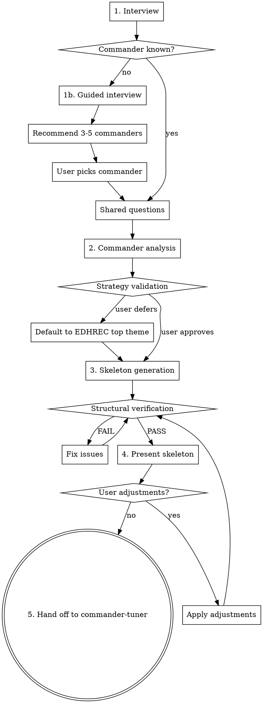

# Commander Deck Builder

## Overview

Structured process for building an MTG Commander deck from scratch. Guides the user through commander selection, preference gathering, and skeleton generation, then hands off to commander-tuner for refinement.

Every card recommendation MUST be grounded in actual card oracle text from Scryfall — never from training data.

## The Iron Rule

**NEVER assume what a card does.** Before including any card in the skeleton, look up its oracle text via the helper scripts. Training data is not oracle text.

**Exception:** During commander *discovery* (recommending commanders to a user who doesn't know what to build), you may use training data to generate a shortlist of candidates. But every recommended commander MUST be verified via `scryfall-lookup` before presenting.

## Setup (First Run)

Before first use, set up the Python environment from the skill's install directory:

```bash
uv sync --directory <skill-install-dir>
```

Then download Scryfall bulk data (~500MB):

```bash
uv run --directory <skill-install-dir> download-bulk --output-dir <skill-install-dir>
```

Subsequent runs skip these steps if the `.venv` exists and bulk data is fresh (<24 hours old).

## Workflow



## Step 1: Interview

### Commander Selection

Ask: "Do you know what commander you want to build a deck for?"

**If yes:**
- Take the commander name.
- Look up via `scryfall-lookup` to validate it exists.
- Verify it's a legal commander using Scryfall's `is:commander` filter (the source of truth for commander legality — don't try to reimplement the rules).
- Ask about partner/friends forever/choose a background pairings if applicable.
- Proceed to shared questions.

**If no — Guided Interview (one question at a time):**

1. **Colors** — "What colors do you enjoy playing? (Pick any combination, or 'no preference')"

2. **Playstyle** — "What's your preferred playstyle?" Present options with brief plain-language explanations so newer players can follow:
   - Aggro (attack fast and hard)
   - Combo (assemble card combinations that win the game)
   - Control (answer threats and win late)
   - Voltron (power up your commander for lethal damage)
   - Tokens (build a wide board of creature tokens)
   - Tribal (build around a creature type)
   - Midrange/Value (generate steady incremental advantage)
   - Group Hug/Politics (make allies, share resources, influence the table)

3. **Mechanics** — "Any specific mechanics you enjoy?" Offer examples with explanations: "+1/+1 counters (growing your creatures over time), theft (stealing opponents' cards), blink (flickering creatures to reuse their effects), spellslinger (casting lots of instants and sorceries), artifacts-matter, landfall (rewards for playing lands)." Open-ended. If the answer maps to multiple distinct sub-archetypes, ask one follow-up to disambiguate with explanations (e.g., "When you say graveyard, are you thinking more reanimator (bringing big creatures back from the dead), aristocrats (sacrificing creatures for value), or self-mill (filling your graveyard as a resource)?").

4. **Favorite cards/sets** — "Any favorite cards or recent sets that excited you? This helps me find commanders in a similar design space."

5. **Play group dynamics** — "How does your play group typically play? (casual/competitive, combo-heavy, creature-heavy, lots of interaction)"

6. **Bracket** — "What power bracket are you targeting? (1-4, or casual/mid/high/max)"

7. **Budget** — "What's your total budget for the deck?"

### Commander Recommendation

After the guided interview, recommend 3-5 commanders that fit. You may use training data to generate a shortlist — this is commander *discovery*, not card evaluation, so the Iron Rule does not apply at this stage. However, every recommended commander MUST be verified via `scryfall-lookup` before presenting (to confirm it exists, is a legal commander, and its oracle text matches the claimed strategy). Check EDHREC deck counts where possible to gauge how well-supported each commander is.

Present each recommendation with:
- Card name and color identity
- Brief explanation of why it matches the user's preferences
- EDHREC deck count (if available) to indicate community support
- Any notable budget implications

Let the user pick.

### Shared Questions

Ask all of these (skipping any already answered during the guided interview):

- **Bracket:** "What power bracket are you targeting? (1-4, or casual/mid/high/max)"
- **Budget:** "What's your total budget for the deck?"
- **Experience level:** "What's your Commander experience level? (beginner/intermediate/advanced)"
- **Pet cards:** "Any cards you definitely want included?" (pet cards, combos they want to build around)

For pet cards: look up each via `scryfall-lookup` to verify it exists and is within the commander's color identity. Slot pet cards into the appropriate template categories — they count against those category budgets. If pet cards exceed ~10, warn the user that it limits the ability to build a balanced skeleton and ask if they want to trim. If a category overflows due to pet cards, shrink it and redistribute remaining slots.

## Step 2: Commander Analysis

1. **Scryfall lookup** — Run: `uv run --directory <skill-install-dir> scryfall-lookup "<Commander Name>"`

   Read the full oracle text, color identity, CMC, and types.

2. **EDHREC research** — Run: `uv run --directory <skill-install-dir> edhrec-lookup "<Commander Name>"`

   For partner commanders: `uv run --directory <skill-install-dir> edhrec-lookup "<Commander 1>" "<Commander 2>"`

   Review top cards, high synergy cards, and themes.

3. **Web research** — Use `WebSearch` for the commander + "deck tech", "strategy", "guide". Use `WebFetch` or the helper script to read strategy articles:

   Run: `uv run --directory <skill-install-dir> web-fetch "<url>" --max-length 10000`

4. **Strategy synthesis** — Summarize the commander's key mechanics, primary strategies, and synergy axes. Present to the user for validation. If the user defers or has no preference, default to the commander's most popular theme on EDHREC and move forward.

The goal is building enough understanding to make smart category fills — not deep analysis (commander-tuner handles that).

## Step 3: Skeleton Generation

### Default Template (100 cards total)

| Category | Count | Notes |
|----------|-------|-------|
| Commander(s) | 1-2 | Already selected |
| Lands | 36-38 | Calculated via Burgess formula: `31 + colors_in_identity + commander_cmc` |
| Ramp | 10 | Mana rocks, dorks, land-fetch spells — prefer synergistic choices |
| Card draw | 10 | Prefer draw that aligns with strategy |
| Targeted removal/disruption | 5-12 | Scaled to bracket (see table below). Includes counterspells if in blue. |
| Board wipes | 2-5 | Scaled to bracket (see table below) |
| Win conditions | 3-5 | Cards that close out a game — combos, overwhelming board states, direct damage engines |
| Engine/synergy pieces | 15-20 | Cards that work with the commander's strategy — enablers, payoffs, value engines |
| Protection/utility | 8-10 | Counterspells, hexproof/indestructible granters, recursion, political tools |

### Template Flexibility

The category counts above are defaults — adjust them after strategy validation to match the user's confirmed direction. Examples:

- **Voltron:** Increase protection/utility, shift engine slots toward equipment/auras
- **Combo:** Increase card draw and win conditions, add tutor slots
- **Aggro/tokens:** Reduce board wipes (they hurt you too), increase engine pieces
- **Control:** Increase interaction across the board, reduce engine pieces
- **Group hug/politics:** Reduce targeted removal, add political tools to utility

**Hard constraints that don't flex:** Lands and ramp stay at Burgess formula minimums regardless of strategy. Total card count must be exactly 100.

### Land Base Composition

The land count comes from the Burgess formula, but composition matters. Guidelines:

- **Basics:** Enough to be fetched by ramp spells (Cultivate, Kodama's Reach, etc.) and not punished by Blood Moon/Back to Basics. Mono/two-color decks lean heavier on basics.
- **Color fixing:** Scale to budget and color count:
  - **Budget ($25-75):** Gain lands, temples (scry lands), tri-lands, check lands, pain lands
  - **Mid ($75-200):** Add filter lands, battle lands, pathway lands, talismans
  - **High ($200+):** Shocks, fetches, original duals if budget allows
- **Utility lands (2-4):** Lands that synergize with the strategy (e.g., creature lands for aggro, Reliquary Tower for draw-heavy, Rogue's Passage for voltron). Don't overload — utility lands that enter tapped or produce colorless hurt consistency.
- **Command Tower and Sol Ring:** Auto-includes in virtually every deck.

Run `mana-audit` after filling to verify color balance. If any color's land production falls below its pip demand, swap basics or upgrade fixing.

### Interaction Scaling by Bracket

Based on Command Zone #658 (2025), EDHREC, and MTGGoldfish guidelines:

| Category | Bracket 1-2 (Casual) | Bracket 3 (Upgraded) | Bracket 4 (Optimized) |
|----------|----------------------|----------------------|----------------------|
| Targeted removal/disruption | 5-7 | 8-10 | 10-12 |
| Board wipes | 2-3 | 3-4 | 4-5 |
| Total interaction | 8-10 | 12-14 | 15-18 |

"Disruption" includes counterspells, discard, and stax pieces — not just creature/artifact removal. Extra interaction slots come out of the engine/synergy budget.

Sources: [Command Zone #658](https://edhrec.com/articles/the-command-zone-commander-deckbuilding-template-for-the-new-era-the-command-zone-658-mtg-edh-magic-gathering), [EDHREC Solve the Equation](https://edhrec.com/articles/solve-the-equation-choosing-and-using-your-interaction), [MTGGoldfish Deckbuilding Checklist](https://www.mtggoldfish.com/articles/the-power-of-a-deckbuilding-checklist-commander-quickie)

### EDHREC Fallback

If EDHREC has no data for the commander (new or obscure cards), fall back to:

1. **Scryfall keyword search** — Search for cards that mechanically synergize with the commander's keywords/oracle text within the commander's color identity (e.g., if the commander cares about +1/+1 counters, search for "+1/+1 counter" in oracle text using `is:commander ci:XX`).
2. **EDHREC theme/archetype data** — Look up the commander's archetype (e.g., "tokens," "voltron," "+1/+1 counters") rather than the specific commander.
3. **Format staples** — Fill remaining slots with well-known staples for the color identity and bracket.

This fallback path produces a more generic skeleton, but commander-tuner's refinement step will tighten it.

### Filling Process

**Category fill order matters.** Fill foundational categories first to ensure the mana base and core infrastructure are solid before spending budget on synergy:

1. **Lands** (cheapest to fill, most important to get right)
2. **Ramp**
3. **Card draw**
4. **Targeted removal and board wipes**
5. **Protection/utility**
6. **Engine/synergy pieces**
7. **Win conditions**

**Per category:**

1. Pull candidates from EDHREC high-synergy and top cards for this commander.
2. **Batch-lookup oracle text for all candidates** — write candidate names to a JSON list, then run: `uv run --directory <skill-install-dir> scryfall-lookup --batch <candidates.json> --bulk-data <bulk-data-path> --cache-dir <skill-install-dir>/.cache`. Read the oracle text for every candidate — verify the card actually belongs in this category and works with this commander.
3. Filter by budget (cheapest printings, track running price total against remaining budget).
4. Filter by bracket (avoid Game Changers above target bracket).
5. Weight by interview preferences (e.g., if user said "I enjoy graveyard strategies," prefer self-mill draw engines over generic draw).
6. Weight by commander synergy (from the analysis step).
7. Include any pet cards the user requested, slotting them into the appropriate category.
8. Fill remaining slots with format staples appropriate to the color identity and budget.

### Structural Verification

After filling, run these checks in order:

1. **Deck stats** — Run: `uv run --directory <skill-install-dir> deck-stats <deck.json> <hydrated.json>`

   Verify total card count is exactly 100, review curve and category counts.

2. **Mana audit** — Run: `uv run --directory <skill-install-dir> mana-audit <deck.json> <hydrated.json>`

   Verify land count and color balance. Fix any FAIL results before proceeding.

3. **Price check** — Run: `uv run --directory <skill-install-dir> price-check <deck.json> --budget <budget> --bulk-data <bulk-data-path>`

   Verify total cost is within the user's budget. If over budget, swap the most expensive non-essential cards (starting from synergy/engine, not lands/ramp) for cheaper alternatives. Re-run until the total is within budget.

**This is a gate — do not present a skeleton that fails any of these checks.**

## Step 4: Present Skeleton

Present the skeleton to the user as a markdown list organized by the builder's categories (lands, ramp, card draw, removal, board wipes, win conditions, engine/synergy, protection/utility). Include brief notes on why key synergy cards were included.

Show a summary:
- Total card count
- Land count and Burgess formula target
- Total estimated cost vs. budget
- Category breakdown

Ask: "Want to make any adjustments before I hand this off for tuning?"

If the user requests changes, apply them, re-run structural verification, and present again.

## Step 5: Hand Off to Commander-Tuner

1. **Write output files** — Save the parsed deck JSON and hydrated card JSON to the working directory.

   The deck JSON format: `{"commanders": [{"name": str, "quantity": int}], "cards": [{"name": str, "quantity": int}, ...], "total_cards": int}`

2. **Invoke commander-tuner** — Invoke `/commander-tuner` with the generated deck. If commander-tuner is not available, tell the user:

   > "I recommend installing the commander-tuner skill to refine this deck further. You can install it with `npx skills install <source>`. The skeleton is a playable starting point, but tuning will significantly improve it."

3. **Carry forward context** — When invoking commander-tuner, provide the following so it can skip re-asking:
   - Bracket target
   - Budget (note how much was spent on the skeleton — remaining budget is for upgrades)
   - Experience level
   - Suggested max swaps: 20 (user can adjust during commander-tuner's intake)
   - Pain points: "This is a freshly generated skeleton — general optimization is the goal"

## Red Flags — STOP If You Catch Yourself Thinking These

| Thought | Reality |
|---------|---------|
| "I know what this card does" | You don't. Look it up. Training data is not oracle text. |
| "EDHREC recommends it so it must be good here" | EDHREC is aggregated data, not analysis. Evaluate for THIS build. |
| "This card is generally good in Commander" | Generic staples aren't always right. Check synergy with THIS commander. |
| "We're over budget but this card is too good to skip" | Budget is a hard constraint. Find a cheaper alternative. |
| "I'll just fill the rest with staples" | Every card should have a reason. Staples are a last resort, not a shortcut. |
| "The mana base is probably fine" | Run `mana-audit`. Don't eyeball mana bases. |
| "This step seems unnecessary for this deck" | Follow every step. The process exists because shortcuts cause mistakes. |
| "I can skip oracle text verification for well-known cards" | No. Look up every card. Even Sol Ring has oracle text worth reading. |

## Experience Level Adaptation

| Aspect | Beginner | Intermediate | Advanced |
|--------|----------|--------------|----------|
| Interview | Explain all terms, give examples | Use terms with brief context | Use shorthand |
| Recommendations | Explain why each card matters | Focus on synergy highlights | Category list with brief notes |
| Strategy | Explain what the strategy does and why | Explain key interactions | Name the archetype and key cards |
| Presentation | Narrative walkthrough of the deck | Grouped by category with notes | Concise tables |

## Script Reference

All scripts are run via `uv run --directory <skill-install-dir>`:

- `scryfall-lookup "Card Name"` — single card oracle text lookup
- `scryfall-lookup --batch <path> --bulk-data <bulk-data-path> --cache-dir <skill-install-dir>/.cache` — batch lookup from JSON name list or parsed deck JSON
- `edhrec-lookup "<Commander Name>"` — EDHREC recommendations for a commander
- `edhrec-lookup "<Commander 1>" "<Commander 2>"` — partner commander EDHREC lookup
- `download-bulk --output-dir <skill-install-dir>` — download/refresh Scryfall bulk data
- `web-fetch "<url>" --max-length 10000` — fetch web page content
- `deck-stats <deck.json> <hydrated.json>` — deck statistics and curve
- `card-summary <hydrated.json>` — compact card table (with `--lands-only` or `--nonlands-only`)
- `mana-audit <deck.json> <hydrated.json>` — mana base health audit
- `price-check <deck.json> [--budget N] --bulk-data <bulk-data-path>` — price validation
- `set-commander <deck.json> "Name"` — move card to commanders list
- `parse-deck <path-to-deck-file>` — multi-format deck list parser (Moxfield, MTGO, plain text, CSV)
- `build-deck <deck.json> <hydrated.json> --cuts <cuts.json> --adds <adds.json>` — apply changes to deck
