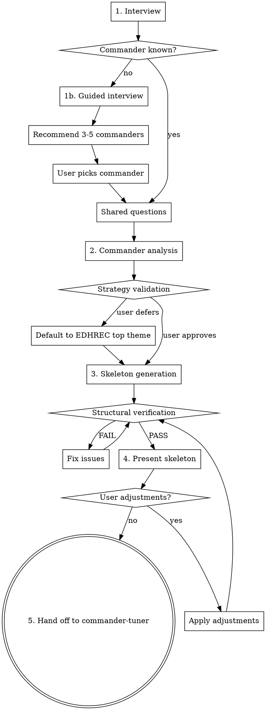

# Commander Deck Builder

## Overview

Structured process for building an MTG Commander deck from scratch. Guides the user through commander selection, preference gathering, and skeleton generation, then hands off to commander-tuner for refinement.

Every card recommendation MUST be grounded in actual card oracle text from Scryfall — never from training data.

## The Iron Rule

**NEVER assume what a card does.** Before including any card in the skeleton, look up its oracle text via the helper scripts. Training data is not oracle text.

**Exception:** During commander *discovery* (recommending commanders to a user who doesn't know what to build), you may use training data to generate a shortlist of candidates. But every recommended commander MUST be verified via `scryfall-lookup` before presenting.

## Setup (First Run)

Before first use, set up the Python environment from the skill's install directory:

```bash
uv sync --directory <skill-install-dir>
```

Then download Scryfall bulk data (~500MB):

```bash
uv run --directory <skill-install-dir> download-bulk --output-dir <skill-install-dir>
```

Subsequent runs skip these steps if the `.venv` exists and bulk data is fresh (<24 hours old).

## Workflow



## Step 1: Interview

### Commander Selection

Ask: "Do you know what commander you want to build a deck for?"

**If yes:**
- Take the commander name.
- Look up via `scryfall-lookup` to validate it exists.
- Verify it's a legal commander using Scryfall's `is:commander` filter (the source of truth for commander legality — don't try to reimplement the rules).
- Ask about partner/friends forever/choose a background pairings if applicable.
- Proceed to shared questions.

**If no — Guided Interview (one question at a time):**

1. **Colors** — "What colors do you enjoy playing? (Pick any combination, or 'no preference')"

2. **Playstyle** — "What's your preferred playstyle?" Present options with brief plain-language explanations so newer players can follow:
   - Aggro (attack fast and hard)
   - Combo (assemble card combinations that win the game)
   - Control (answer threats and win late)
   - Voltron (power up your commander for lethal damage)
   - Tokens (build a wide board of creature tokens)
   - Tribal (build around a creature type)
   - Midrange/Value (generate steady incremental advantage)
   - Group Hug/Politics (make allies, share resources, influence the table)

3. **Mechanics** — "Any specific mechanics you enjoy?" Offer examples with explanations: "+1/+1 counters (growing your creatures over time), theft (stealing opponents' cards), blink (flickering creatures to reuse their effects), spellslinger (casting lots of instants and sorceries), artifacts-matter, landfall (rewards for playing lands)." Open-ended. If the answer maps to multiple distinct sub-archetypes, ask one follow-up to disambiguate with explanations (e.g., "When you say graveyard, are you thinking more reanimator (bringing big creatures back from the dead), aristocrats (sacrificing creatures for value), or self-mill (filling your graveyard as a resource)?").

4. **Favorite cards/sets** — "Any favorite cards or recent sets that excited you? This helps me find commanders in a similar design space."

5. **Play group dynamics** — "How does your play group typically play? (casual/competitive, combo-heavy, creature-heavy, lots of interaction)"

6. **Bracket** — "What power bracket are you targeting? (1-4, or casual/mid/high/max)"

7. **Budget** — "What's your total budget for the deck?"

### Commander Recommendation

After the guided interview, recommend 3-5 commanders that fit. You may use training data to generate a shortlist — this is commander *discovery*, not card evaluation, so the Iron Rule does not apply at this stage. However, every recommended commander MUST be verified via `scryfall-lookup` before presenting (to confirm it exists, is a legal commander, and its oracle text matches the claimed strategy). Check EDHREC deck counts where possible to gauge how well-supported each commander is.

Present each recommendation with:
- Card name and color identity
- Brief explanation of why it matches the user's preferences
- EDHREC deck count (if available) to indicate community support
- Any notable budget implications

Let the user pick.

### Shared Questions

Ask all of these (skipping any already answered during the guided interview):

- **Bracket:** "What power bracket are you targeting? (1-4, or casual/mid/high/max)"
- **Budget:** "What's your total budget for the deck?"
- **Experience level:** "What's your Commander experience level? (beginner/intermediate/advanced)"
- **Pet cards:** "Any cards you definitely want included?" (pet cards, combos they want to build around)

For pet cards: look up each via `scryfall-lookup` to verify it exists and is within the commander's color identity. Slot pet cards into the appropriate template categories — they count against those category budgets. If pet cards exceed ~10, warn the user that it limits the ability to build a balanced skeleton and ask if they want to trim. If a category overflows due to pet cards, shrink it and redistribute remaining slots.
