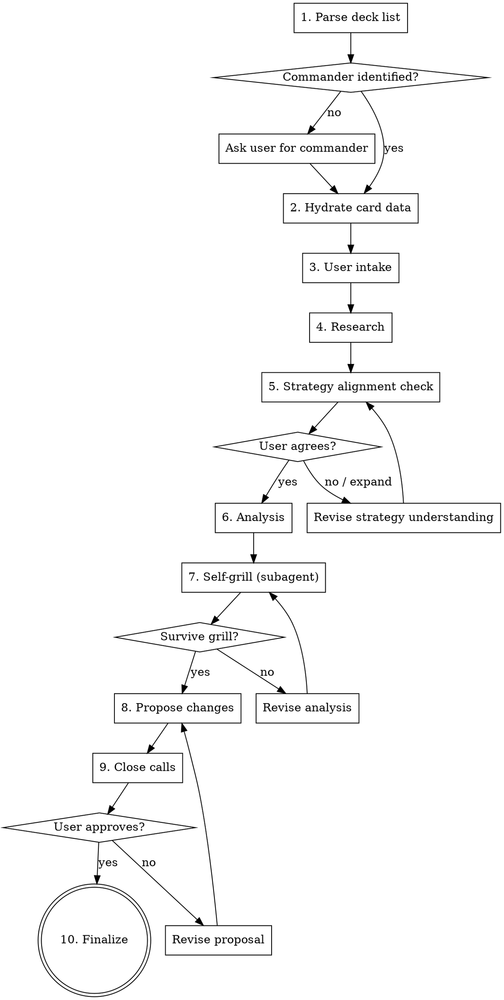

# Commander Deck Tuner

## Overview

Structured process for analyzing and tuning MTG Commander decks. Every recommendation MUST be grounded in actual card oracle text from Scryfall — never from training data.

## The Iron Rule

**NEVER assume what a card does.** Before referencing any card's abilities, look up its oracle text via the helper scripts. Training data is not oracle text.

## Setup (First Run)

Before first use, set up the Python environment from the skill's install directory:

```bash
uv sync --directory <skill-install-dir>
```

Then download Scryfall bulk data (~500MB):

```bash
uv run --directory <skill-install-dir> download-bulk --output-dir <skill-install-dir>
```

Subsequent runs skip these steps if the `.venv` exists and bulk data is fresh (<24 hours old).

## Workflow



## Step 1: Parse Deck List

Run: `uv run --directory <skill-install-dir> parse-deck <path-to-deck-file> [--format <format>] [--deck-size <N>]`

Supported formats: `commander` (default, 100 cards), `brawl` (60 cards, Standard card pool), `historic_brawl` (100 cards, Historic/Arena card pool). Use `--deck-size` to override the default deck size (e.g., `--format historic_brawl --deck-size 60` for 60-card Historic Brawl).

If the format is not obvious from context, ask the user: "What format is this deck for? (Commander, Brawl, Historic Brawl)"

This auto-detects format (Moxfield, MTGO, plain text, CSV) and outputs JSON with `commanders` and `cards`. Automatically strips Moxfield set code suffixes like `(OTJ) 222` from card names.

If `commanders` is empty (common with Moxfield exports that lack `//Commander` headers), ask the user who the commander is. Don't guess — the first card in the list is often the commander, but not always. Supports partner commanders, friends forever, and background pairings.

Run `set-commander <deck.json> 'Commander Name'` to move the card from the cards list to the commanders list. This outputs updated JSON to stdout. Supports partner commanders, friends forever, and background pairings.

## Step 2: Hydrate Card Data

Run: `uv run --directory <skill-install-dir> scryfall-lookup --batch <parsed-deck-json> --bulk-data <bulk-data-path> --cache-dir <skill-install-dir>/.cache`

Looks up every card (including the commander) in Scryfall bulk data. Falls back to Scryfall API for cards not found locally. Results are cached persistently in the skill's install directory so repeat analyses are instant. If bulk data is missing or stale, download it first:

Run: `uv run --directory <skill-install-dir> download-bulk --output-dir <skill-install-dir>`

**Read the hydrated data.** Before any analysis, read the oracle text for every card, especially the commander. This is where you build your understanding of the deck.

## Step 2.5: Baseline Metrics

Run the deck stats and card summary scripts to establish a quantitative baseline and get readable oracle text:

Run: `uv run --directory <skill-install-dir> card-summary <hydrated-cards-json> --nonlands-only`
Run: `uv run --directory <skill-install-dir> card-summary <hydrated-cards-json> --lands-only`
Run: `uv run --directory <skill-install-dir> deck-stats <parsed-deck-json> <hydrated-cards-json>`

Review the card summary output to build your understanding of every card's oracle text. Use the deck stats to note the starting land count, ramp count, creature count, average CMC, curve distribution, and total card count. Flag immediately if the total card count does not match the deck's expected size (100 for Commander/Historic Brawl, 60 for Brawl, or the user's specified deck size).

Review the `alternative_cost_cards` section in deck-stats output. For any card with alternative costs (suspend, adventure, foretell, etc.), note the cost most likely to be used in this deck. Do not evaluate these cards at their CMC alone.

## Step 3: User Intake

Ask all of these in a single message:

> Before I start analyzing, a few quick questions:
> 1. What's your Commander experience level? (beginner / intermediate / advanced)
> 2. What power bracket are you targeting? (1-5, or casual/core/upgraded/optimized/cEDH)
> 3. Budget for upgrades? (dollar amount)
> 4. Max number of card swaps?
> 5. Any specific pain points (e.g., "I run out of gas," "mana base is inconsistent"), or just general optimization?

Handle partial or natural language answers. Fill sensible defaults for anything not specified. Only follow up if something is truly ambiguous.

**Format-specific context to mention when relevant:**
- **Brawl/Historic Brawl:** No commander damage (Voltron strategies are weaker), starting life is 25 (2-player) or 30 (multiplayer) instead of 40, free first mulligan
- **Brawl:** Standard card pool — many Commander staples are not legal. Colorless commanders can include any number of basics of one chosen type.
- **Historic Brawl:** Arena Brawl card pool — broader than Standard but different ban list from Commander

If any of these values were already provided earlier in the conversation (e.g., from a commander-builder handoff), confirm them with the user rather than re-asking. Example: "I see you're targeting bracket 3 with $94 remaining for upgrades (from a $500 total budget) — still correct?"

When receiving a builder handoff, note both the **total budget** and the **upgrade budget** (total minus skeleton cost). Use the upgrade budget for swap decisions during analysis. Track owned cards separately — they don't count toward either budget. The total budget will be used in Step 10 for the final summary.

## Step 4: Research

Run: `uv run --directory <skill-install-dir> edhrec-lookup "<Commander Name>"`

For partner commanders: `uv run --directory <skill-install-dir> edhrec-lookup "<Commander 1>" "<Commander 2>"`

Also use `WebSearch` for the commander + "deck tech", "strategy", "guide" to find Command Zone, MTGGoldfish, and other content creator analysis.

**Fetching strategy articles:** Use `WebFetch` first. If it returns an empty JS shell or navigation-only content, fall back to the helper script:

Run: `uv run --directory <skill-install-dir> web-fetch "<url>" --max-length 10000`

This uses browser-like headers and falls back to `curl` for sites that block Python requests via TLS fingerprinting (e.g., Commander's Herald). Use `--max-length` to avoid overwhelming context with full page content.

**Key principle:** Research informs but doesn't dictate. EDHREC popularity doesn't automatically make a card right, and unpopularity doesn't make it wrong.

**Brawl format note:** EDHREC data is sourced from Commander/EDH decks. When tuning a Brawl deck, EDHREC recommendations must be legality-checked against the deck's format before recommending. Use `card-search --format <format>` to verify candidates are legal.

## Step 5: Strategy Alignment Check

Before analyzing individual cards, present your understanding of the commander's key mechanics and the strategic directions they suggest. **Ask the user to validate or expand this.**

For example: "Based on Alibou's oracle text, the deck wants: (1) high artifact density for bigger X triggers, (2) go-wide with artifact creature tokens, and (3) extra combats to re-trigger. Does that match how you think about the deck, or are there angles I'm missing?"

This catches blind spots — the user may see synergies you missed (like trigger-copying effects, combo lines, or political angles). Don't start evaluating cards until you and the user agree on what "good" looks like for this specific commander.

Present your estimated trigger multiplier range for `cut-check` analysis (e.g., "Based on Obeka's 3 base power with typical pump, I'm estimating 3-7 extra upkeeps per hit"). **Ask the user to validate this range.** The multiplier range feeds into `cut-check` and determines how trigger values are evaluated.

## Step 5.5: Commander Interaction Audit

Before evaluating individual cards, systematically check for mechanical interactions between the commander and every card in the deck. This step catches synergies that are invisible when reading cards in isolation.

### Keyword Combinations

List the commander's keywords and any keywords granted by cards in the deck. Check every pair for emergent effects:
- **Evasion stacking:** menace + "can't be blocked by more than one creature" = unblockable. Any blocking restriction combined with a conflicting blocking requirement may create unblockable.
- **Damage multiplication:** double strike + combat damage triggers = double triggers. Double strike + lifelink = double life. Trample + deathtouch = 1 damage kills, rest tramples over.
- **Protection stacking:** ward + hexproof, indestructible + regenerate — identify which are redundant vs. complementary.

This applies to all cards, not just the commander. Equipment and auras that grant keywords to the commander are especially important.

### Trigger Multiplication

Identify the commander's core multiplier (extra upkeeps, extra combats, extra turns, extra phases, trigger copying, token doubling, etc.). For EVERY triggered ability in the deck that fires during the multiplied window, calculate its output at 1x, 3x, and 5x the base rate. Present and evaluate the **multiplied** value, not the base value.

A "1 damage to each opponent" trigger looks marginal at 1x. At 5x with 3 opponents, it's 15 damage + 15 life — a legitimate win condition. Evaluate accordingly.

For commanders whose trigger scales with combat damage dealt, explicitly identify **pump as a strategic pillar**. Each +1 power is not just +1 damage — it's +1 trigger of every effect in the multiplied window.

### Feedback Loops

For each card, ask: "Does this card's output feed back into its own input or the commander's trigger condition?" Examples:
- A +1/+1 counter source on a commander whose trigger scales with power (more counters → more damage → more triggers → more counters)
- A token creator that increases a count used by another card's scaling ability
- A theft effect where stolen permanents change type to match a tribal count, increasing future theft
- A card that draws cards in a hand-size-matters deck

Cards with feedback loops are almost always stronger than they appear in isolation. Flag them before the analysis phase.

### Recurring Cards

Identify all cards that return themselves to a usable zone: re-suspend, buyback, retrace, escape, flashback, "return to hand" clauses, "exile with time counters" effects. Evaluate these on their per-game value (total free casts over a typical game), not their per-cast value. A 6-mana spell that re-suspends and gets cast for free every 1-2 turns is a permanent with a triggered ability, not a one-shot.

### Commander Multiplication

Identify cards in the deck that multiply the commander's impact by creating copies or duplicating abilities. These fall into two categories:

**Commander Copies** — Cards that create token copies or become copies of the commander (e.g., Helm of the Host, Spark Double, Clone effects). Non-legendary copies bypass the legend rule, so each copy retains all triggered and activated abilities and functions independently. A commander with three triggered abilities effectively becomes two commanders when copied.

**Ability Copiers** — Cards that copy or double the commander's triggered or activated abilities (e.g., Strionic Resonator, Rings of Brighthearth, Panharmonicon for ETB commanders, Teysa Karlov for death trigger commanders, Isshin for attack trigger commanders). These double specific abilities and are most powerful when the commander's abilities have high base value.

For each identified multiplier card, note:
1. What it copies (the full commander, or specific triggered/activated abilities)
2. How many additional copies/triggers it provides per activation or per trigger event
3. Whether it bypasses the legend rule (for copy effects)
4. Which specific commander abilities benefit

**These cards are force-multipliers.** During cut analysis, flag any commander-multiplication card as high-value — it should not be cut without explicit justification that the replacement provides comparable or better strategic value.

Run `cut-check` to identify these cards mechanically. The `commander_multiplication` field in the output flags copy and ability-doubler effects.

### Combo Detection

Run the combo search on the deck:

Run: `uv run --directory <skill-install-dir> combo-search <parsed-deck-json>`

Review the output:

**Existing combos:** List each combo with its cards, result, and bracket tag. Flag all cards involved as combo pieces — these cards must not be evaluated in isolation during analysis. Distinguish between:
- **Game-winning combos** (result contains "infinite" or "win the game"): flag prominently, these are critical to protect during analysis.
- **Value interactions** (non-infinite synergies): note as context, but these don't block cuts.

**Near-misses:** List combos the deck is one card away from completing, with the missing card identified. These are potential additions to evaluate in Step 6.

**Bracket compliance:** Check combo results against the user's target bracket:
- **Bracket 1-2:** Intentional two-card infinite combos are prohibited. Flag existing infinite combos as bracket violations — they must be cut or the user must acknowledge they're playing above bracket. Do NOT suggest near-miss infinite combos as additions.
- **Bracket 3:** Infinite combos are allowed but should not reliably fire before turn 6. Flag low-CMC/easily-tutored infinite combos as potential bracket concerns.
- **Bracket 4:** No restrictions on combos.

If `combo-search` returns empty results (API unavailable), proceed without combo data — the analysis works fine without it.

## Step 6: Analysis

Group cards by commander-aware roles — roles defined by how they work with THIS commander, not generic categories. Analyze each group as a unit.

**For every card, answer:** "How does this card specifically interact with this commander?" Cite the oracle text.

### Mana Base & Curve Audit

Before evaluating individual cards, count the deck's mana infrastructure:
- **Land count** and **ramp pieces** (mana rocks, dorks, land-fetching spells)
- **Average CMC** of nonland cards
- **Curve distribution** (how many cards at each mana value)

**Land count is a hard constraint, not a suggestion.** Calculate the Burgess formula result (`31 + colors_in_identity + commander_cmc`) and treat it as the target. The `mana-audit` script enforces this — if it returns FAIL, you must add lands or cut fewer lands.

Proposing a land count below the Burgess formula result requires the `mana-audit` script to return PASS or WARN (not FAIL). Proposing a land count below 36 is almost always a FAIL. Do not rationalize — fix it.

Flag any existing problems: too few lands, curve too high, not enough ramp for the curve, color fixing gaps.

Sources: [EDHREC Superior Numbers](https://edhrec.com/articles/superior-numbers-land-counts), [Draftsim Land Count Guide](https://draftsim.com/mtg-edh-deck-number-of-lands/), Frank Karsten's Commander mana base simulations.

### Interaction Audit

Count the deck's removal and interaction pieces. Compare against bracket-appropriate targets:

| Category | Bracket 1-2 (Casual) | Bracket 3 (Upgraded) | Bracket 4 (Optimized) |
|----------|----------------------|----------------------|----------------------|
| Targeted removal/disruption | 5-7 | 8-10 | 10-12 |
| Board wipes | 2-3 | 3-4 | 4-5 |
| Total interaction | 8-10 | 12-14 | 15-18 |

"Disruption" includes counterspells, discard, and stax pieces — not just creature/artifact removal. Flag decks that fall below the low end of their bracket's range.

Sources: [Command Zone #658](https://edhrec.com/articles/the-command-zone-commander-deckbuilding-template-for-the-new-era-the-command-zone-658-mtg-edh-magic-gathering), [EDHREC Solve the Equation](https://edhrec.com/articles/solve-the-equation-choosing-and-using-your-interaction), [MTGGoldfish Deckbuilding Checklist](https://www.mtggoldfish.com/articles/the-power-of-a-deckbuilding-checklist-commander-quickie)

### Analysis Dimensions

- Synergy with the commander and other cards
- Mana curve distribution
- Card type balance (creatures, interaction, ramp, draw)
- Removal/interaction suite
- Win conditions
- Mana base quality
- Bracket compliance (count Game Changers vs. target bracket)
- Pain point focus (weight toward user-identified issues)
- Combo awareness (reference combo data from Step 5.5 — combo pieces should be evaluated in context of the combo, not in isolation; near-miss cards are candidates for additions)

### Cut Checklist

Before recommending ANY cut, work through this checklist for every candidate. Skipping items is how cards get misjudged.

0. **Full oracle text verification.** Before evaluating any card for a cut, look up its complete oracle text via `scryfall-lookup <card name>`. The `card-summary` table truncates oracle text and is for scanning only, not for evaluating individual cards. Never base a cut decision on truncated oracle text.

0.5. **Alternative cost check.** If the card has suspend, foretell, adventure, evoke, flashback, escape, or other alternative casting costs, evaluate at the cost most likely to be used in this deck, not the printed CMC. A suspend card in an extra-upkeep deck is not an 8-drop.

1. **Clause-by-clause oracle text analysis.** Read each sentence of the card's oracle text independently. Ask: "How does THIS specific clause interact with my commander and the deck's strategy?" Cards often have 3-4 separate abilities. If you only evaluated one, you haven't read the card. Common missed clauses:
   - Attack/block restrictions ("can't attack its owner," "can't be blocked by more than one creature")
   - Type-changing effects ("is a Mercenary in addition to its other types")
   - Self-recurring mechanics (re-suspend, return to hand, exile with counters)
   - Static effects on other permanents ("creatures you control but don't own are...")

2. **Defensive value check.** Does this card reduce incoming damage or attacks? Protect other permanents? Deter opponents politically? Force opponents to attack each other? If the user's pain point involves survivability, weight defensive value higher than offensive value.

3. **Feedback loop check.** Does removing this card break a self-reinforcing cycle? (See Step 5.5.) If so, the cut needs much stronger justification.

4. **Pain point regression check.** Does cutting this card make the user's stated problem worse? A card that gains life in a deck whose pilot gets ganged up on may be load-bearing even if it looks underpowered.

5. **Multiplied value calculation.** Calculate the card's output at the commander's expected trigger multiplier (see Step 5.5). If a trigger looks weak at 1x but kills a player at 5x, it is a win condition, not a role player. Do not cut win conditions for utility unless replacing with a better win condition.

6. **Combo piece check.** Is this card part of an existing combo line (from the Step 5.5 combo search)? If so, cutting it breaks that combo. Distinguish based on the `result` field:
   - **Game-winning combos** (result contains "infinite" or "win the game"): hard to justify cutting. Requires explicit justification — "this combo is too slow for the bracket" or "this combo is a bracket violation" are valid. "I didn't notice it was a combo piece" is not. If cutting, note which combo it breaks and verify the replacement strategy still has a viable win condition.
   - **Value interactions** (non-infinite synergies): note the interaction but treat as a soft consideration, not a hard gate.

### Cuts — Be Careful

Before recommending ANY cut, re-read the oracle text of BOTH the card and the commander. Articulate specifically why the card underperforms in THIS deck. Cards that look mediocre in general can be incredible with specific commanders.

### Additions

Source from EDHREC high-synergy cards and web research. Supplement with `card-search` to find synergistic cards EDHREC may not surface — search the local bulk data by color identity, oracle text, type, CMC, and price:

Run: `uv run --directory <skill-install-dir> card-search --bulk-data <bulk-data-path> --color-identity <ci> --oracle "<relevant-keyword>" --price-max <budget-per-card>`

Recommend the cheapest available printing. Track running cost against budget.

### Swap Balance Check

After drafting all cuts and additions, verify the swaps don't break the mana base:
- **Land count must stay in a healthy range.** If you cut a land, you must add a land (or add ramp to compensate). If the deck is already land-light, don't cut lands at all.
- **Mana curve must not get worse.** If you're cutting a 2-drop for a 5-drop, note the curve impact. Swaps that raise the average CMC need justification.
- **Color balance matters.** Don't cut the deck's only source of a color. Check that color-producing land count supports the color requirements of the additions.
- **Ramp count must stay stable.** Don't cut ramp pieces unless the deck has too many or you're adding equivalent ramp.
- **Color balance must be verified quantitatively.** After drafting all swaps, run `mana-audit --compare` with the old and new deck. If any color's land percentage drops below its pip demand percentage, adjust the mana base (swap a basic land for a different basic, replace a dual land, etc.). Do not present swaps that create a color deficit.

If the swaps would damage the mana base, revise before presenting. It is better to make fewer swaps than to break the deck's ability to cast its spells.

## Step 6.5: Mechanical Cut Check

Run `price-check` on all proposed additions with the user's budget (`uv run --directory <skill-install-dir> price-check <adds-names-json> --budget <budget> --bulk-data <bulk-data-path>`). If any single card or the total exceeds budget, find cheaper alternatives before proceeding. Do not send cards to the self-grill that the user cannot afford.

Before launching the self-grill, run `cut-check` on every proposed cut. Read the output.

For each proposed cut, write out (internally, not presented to user):
1. **Multiplied value:** [from cut-check output, or "no matching triggers"]
2. **Pain point regression:** Does cutting this card make the user's stated problem worse? [yes/no + one sentence why]
3. **Defensive value:** What does this card prevent, deter, or protect? [one sentence, or "none"]
4. **Replacement justification:** What specific card in the additions replaces this card's role? [name + one sentence]
5. **Combo line:** Is this card part of a combo from Step 5.5? [combo name + result, or "not a combo piece"]. If game-winning, justify why cutting is acceptable.

If you cannot fill in all five fields, you have not evaluated the card. Do not proceed to the self-grill.

Review the multiplied trigger values from `cut-check` output. Any cut where the multiplied output is significant for the user's stated goals requires explicit justification for why the replacement is better *for the user's pain point*. If you cannot articulate this, do not cut it.

## Step 7: Self-Grill (Two-Agent Debate)

Before presenting to the user, launch **two subagents** that debate the proposed changes:

**Proposer agent** receives:
- The proposed cuts and additions with full reasoning
- The hydrated card data for all cards involved (cuts, adds, and the commander)
- The user's stated goals, pain points, and budget
- The `cut-check` output for all proposed cuts
- The `mana-audit` output for the proposed deck
- The `price-check` output for all proposed additions
- The `combo-search` output for the current deck (existing combos and near-misses)
- Framing: "These are the flags from mechanical analysis. You addressed them in your proposal. Defend your reasoning against challenges. Do not concede a point unless the challenger provides a specific oracle text interaction or quantitative argument you missed. Pushing back is your job."

**Challenger agent** receives:
- The same data as the proposer
- The `cut-check` output for all proposed cuts and the `mana-audit` output
- The `price-check` output for all proposed additions
- The `combo-search` output for the current deck
- Verify the proposer addressed every `cut-check` flag. Any unaddressed flag is an automatic challenge.
- Verify `mana-audit` shows PASS. Any WARN or FAIL is an automatic challenge.
- The red flags table from this skill
- Explicit instructions to:
  - Re-read the oracle text of every proposed cut and challenge whether it's truly weak with THIS commander
  - Check each proposed addition actually works the way the proposer claims
  - Verify the swap balance (land count, curve, ramp, color balance)
  - Look for missing synergy angles the proposer didn't consider
  - Challenge budget allocation (is the most expensive card really the highest priority?)
  - Verify total cost does not exceed budget and flag any card that consumes a disproportionate share of the budget
  - Receive and independently re-read the full hydrated oracle text for every proposed cut — do NOT rely on the proposer's paraphrasing. Any discrepancy between the proposer's description and the actual oracle text is an automatic flag
  - Check every clause of every cut card's oracle text, not just the primary ability — look for defensive clauses, type-changing effects, self-recurring mechanics, and static effects on other permanents
  - Verify keyword interactions between the commander and each cut card (see Step 5.5)
  - Calculate the multiplied value of any upkeep/combat/phase triggers being cut and challenge whether the proposer evaluated at the correct multiplier
  - Verify no proposed cut breaks a game-winning combo without explicit justification from the proposer. Any unaddressed combo break is an automatic challenge.
  - For Brawl formats: verify that strategic evaluations account for format-specific rules (no commander damage, lower life totals, free mulligan). Voltron strategies should be scrutinized more heavily in Brawl since commander damage doesn't apply.
  - **Commander fitness evaluation:** Evaluate whether the commander itself is the weakest link. Apply the **commander identity test:** "If this deck's commander were hidden, could you guess what it is from the cards?" If the deck's strategy doesn't clearly point back to the commander, the commander may not be driving the strategy. Specifically:
    - Evaluate how many cards mechanically interact with the commander's oracle text (triggered/activated ability synergies, not just thematic overlap)
    - Compare the commander's CMC and casting requirements against the deck's mana base
    - Consider whether the user's stated pain points trace back to the commander (e.g., "I can never get going" + 7-CMC commander)
    - If the commander appears to be underperforming, use training data to shortlist 1-2 alternative commanders whose color identity covers all cards currently in the deck. Verify each alternative via `scryfall-lookup` before presenting. The Iron Rule exception for commander discovery applies: training data may inform the shortlist, but oracle text must be verified. A narrower color identity is technically possible if no cards require the dropped color, but flag this prominently as it would require cutting cards.

The challenger reports issues. The proposer responds or revises. Repeat until the challenger has no remaining objections. Then present the surviving proposal to the user.

**This is not a formality.** If both agents agree immediately, something is wrong — the challenger isn't pushing hard enough. Expect at least 2-3 rounds of challenges.

## Step 8: Propose Changes

**Before presenting any proposal to the user, run `mana-audit` on the proposed new deck (using `build-deck` output). If `mana-audit` returns FAIL, revise cuts/adds until it passes. Do not present a failing proposal.**

This is not a guideline. It is a gate. A proposal with FAIL status does not leave this step.

**The user has not seen the debate.** Present the post-debate proposal as a complete, self-contained recommendation with full reasoning for every swap. Do not reference the debate, do not say "after reviewing" or "the revised list" — present it as your recommendation with the reasoning baked in.

For each swap, explain:
- Why the cut underperforms with THIS commander (cite oracle text)
- Why the addition is better for the strategy (cite oracle text)
- Any mana base or curve impact

Present changes adapted to the user's experience level:
- **Beginner:** Full explanations, define terms like "card advantage"
- **Intermediate:** Explain specific interactions, skip basics
- **Advanced:** Concise tables, minimal explanation

Format: paired swaps where possible (cut X → add Y). Show running price total and swap count vs. budget.

## Step 8.5: Impact Verification

Before presenting close calls, verify the proposal's impact on deck metrics:

Run: `uv run --directory <skill-install-dir> deck-diff <old-deck.json> <new-deck.json> <old-hydrated.json> <new-hydrated.json>`

Confirm:
- Total card count matches the deck's expected size
- Land count stays in a healthy range
- Average CMC didn't increase unexpectedly
- Ramp count didn't decrease

If any metric is off, revise the proposal before continuing.

## Step 9: Close Calls

After presenting the proposal, surface any **close calls from the debate** — swaps where the proposer and challenger genuinely disagreed, or where a card was borderline keep/cut. Present these as decisions for the user:

> "A few things that were close calls — I'd like your input:"
> - "Card X could go either way. It does A (good with your commander) but also B (bad). Keep or cut?"
> - "I considered Card Y as an addition but it costs $Z. Worth it, or would you rather save the budget?"

This gives the user final say on the genuinely debatable choices without making them re-evaluate every swap. Adjust the proposal based on their answers.

### Commander Swap Consideration

If the challenger flagged the commander during the self-grill, present it as a close call — never as a firm recommendation:

> "One thing worth considering: [specific observation about why the commander underperforms with this deck's composition]. [Alternative Commander] in the same colors does [specific oracle text interaction] which fits better with what the deck is actually doing. This would be a significant change though — worth exploring, or do you want to keep [current commander]?"

**This is always a close call.** The user chose their commander for a reason. The skill surfaces the information; the user decides.

## Step 10: Finalize

Output the updated deck list in the same format as the input. Export a Moxfield-importable text file:

Run: `uv run --directory <skill-install-dir> export-deck <new-deck.json>`

### Final Budget Summary

Run `price-check` on the complete final deck to get the total cost:

Run: `uv run --directory <skill-install-dir> price-check <new-deck.json> --bulk-data <bulk-data-path>`

Present a budget summary that shows the full picture:

> **Budget Summary**
> | | Cost |
> |---|---|
> | Skeleton (from builder) | $X |
> | Upgrades (this session) | $Y |
> | **Total deck cost** | **$Z** |
> | Owned cards (not counted) | card1, card2, ... |
> | Total budget | $B |
> | **Remaining** | **$R** |

If the total budget was not provided (standalone tuner session without builder), show just the upgrade cost and total deck cost.

Include: summary of changes, swap count.

Offer (don't force): mana curve before/after, category breakdown comparison, "next upgrades" list for future budget.

## Red Flags — STOP If You Catch Yourself Thinking These

| Thought | Reality |
|---------|---------|
| "I know what this card does" | You don't. Look it up. Training data is not oracle text. |
| "EDHREC recommends it so it must be good here" | EDHREC is aggregated data, not analysis. Evaluate for THIS build. |
| "This card is generally weak" | Weak in general ≠ weak with this commander. Read both oracle texts. |
| "We're over budget but this card is too good to skip" | Budget is a hard constraint. Find a cheaper alternative. |
| "My analysis is thorough enough, no need to self-grill" | The self-grill catches exactly this overconfidence. Run it every time. |
| "I'll just recommend the EDHREC top cards" | That's not analysis, that's copying. Think about THIS deck. |
| "This step seems unnecessary for this deck" | Follow every step. The process exists because shortcuts cause mistakes. |
| "Cutting this land for a nonland is fine, the deck has enough" | Count the lands. Count the ramp. Do the math. Don't eyeball mana bases. |
| "I understand what this commander wants" | You might be missing angles. Present your strategic read and ask the user before analyzing. They play the deck — you don't. |
| "This card only works with N other cards in the deck" | Check whether the card creates its own enablers — theft effects that change types, token creators that increase counts, self-recurring cards that sustain themselves. |
| "This trigger is too small to matter" | Multiply by expected extra triggers AND by number of opponents. 1 damage × 5 upkeeps × 3 opponents = 15. Do the math. |
| "I've read this card" | Did you read every clause? Defensive restrictions, type-changing effects, self-recurring mechanics, and static effects on other permanents are commonly missed. |
| "This is redundant evasion/protection" | Redundancy in the deck's most important effects is intentional. Before cutting, check whether the card creates a unique mechanical interaction (e.g., blocking restriction + menace = unblockable) that no other card replicates. |
| "I can cut one more land, the ramp covers it" | Run `mana-audit`. If it says FAIL, you cannot. Ramp does not replace lands — it supplements them. |

## Experience Level Adaptation

| Aspect | Beginner | Intermediate | Advanced |
|--------|----------|--------------|----------|
| Terminology | Define terms (card advantage, tempo, etc.) | Use terms freely | Use shorthand |
| Explanations | Why each card matters | Focus on non-obvious interactions | Just the synergy line |
| Mana curve | Explain what good curve looks like | Note problems | Numbers only |
| Presentation | Narrative with examples | Grouped analysis | Concise tables |

## Script Input Formats

- `parse-deck <path> [--format FORMAT] [--deck-size N]` — outputs `{"format": str, "deck_size": int, "commanders": [{"name": str, "quantity": int}], "cards": [...], "total_cards": int}`
- `set-commander <deck.json> "Name" ["Name2"]` — outputs updated deck JSON to stdout
- `scryfall-lookup "Card Name"` — outputs single card JSON to stdout
- `scryfall-lookup --batch <path>` — accepts either a JSON list of name strings or a parsed deck JSON; outputs list of card JSONs
- `price-check <path> [--budget N]` — accepts either a JSON list of name strings or a parsed deck JSON; outputs prices and running total
- `build-deck --cuts/--adds <path>` — accepts list of `{"name": str, "quantity": int}` dicts or plain name strings (quantity defaults to 1)
- `cut-check --cuts <path>` — expects JSON list of name strings
- `deck-stats` — outputs `{..., "alternative_cost_cards": [{"name": str, "cmc": float, "alt_costs": [{"type": str, "cost": str}]}]}`
- `mana-audit --compare` — outputs `{"primary": {"source": str, ...}, "comparison": {"source": str, ...}, "delta": {...}}`
- `export-deck <deck.json>` — outputs Moxfield import format (`N CardName` lines) to stdout
- `card-search --bulk-data <path> [--color-identity CI] [--oracle REGEX] [--type TYPE] [--cmc-min N] [--cmc-max N] [--price-min N] [--price-max N] [--sort price-desc] [--limit 25] [--json] [--format FORMAT]` — searches local bulk data for cards matching filters; `--format` filters by format legality (commander, brawl, historic_brawl); default output is a compact table sorted by price descending
