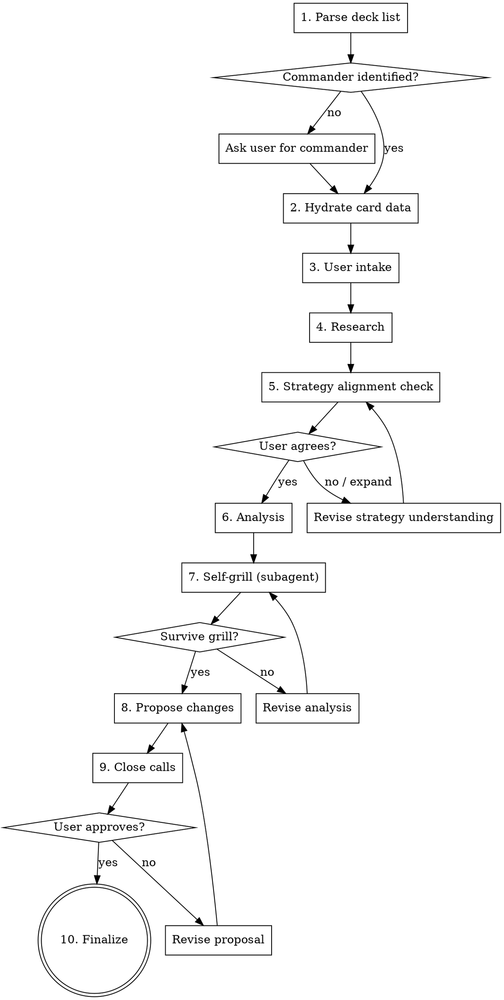

# Commander Deck Tuner

## Overview

Structured process for analyzing and tuning MTG Commander decks. Every recommendation MUST be grounded in actual card oracle text from Scryfall — never from training data.

## The Iron Rule

**NEVER assume what a card does.** Before referencing any card's abilities, look up its oracle text via the helper scripts. Training data is not oracle text.

## Setup (First Run)

Before first use, set up the Python environment from the skill's install directory:

```bash
uv sync --directory <skill-install-dir>
```

Then download Scryfall bulk data (~500MB):

```bash
uv run --directory <skill-install-dir> download-bulk --output-dir <skill-install-dir>
```

Subsequent runs skip these steps if the `.venv` exists and bulk data is fresh (<24 hours old).

## Workflow



## Step 1: Parse Deck List

Run: `uv run --directory <skill-install-dir> parse-deck <path-to-deck-file>`

This auto-detects format (Moxfield, MTGO, plain text, CSV) and outputs JSON with `commanders` and `cards`. Automatically strips Moxfield set code suffixes like `(OTJ) 222` from card names.

If `commanders` is empty (common with Moxfield exports that lack `//Commander` headers), ask the user who the commander is. Don't guess — the first card in the list is often the commander, but not always. Supports partner commanders, friends forever, and background pairings.

## Step 2: Hydrate Card Data

Run: `uv run --directory <skill-install-dir> scryfall-lookup --batch <names-json> --bulk-data <bulk-data-path> --cache-dir <skill-install-dir>/.cache`

Looks up every card (including the commander) in Scryfall bulk data. Falls back to Scryfall API for cards not found locally. Results are cached persistently in the skill's install directory so repeat analyses are instant. If bulk data is missing or stale, download it first:

Run: `uv run --directory <skill-install-dir> download-bulk --output-dir <skill-install-dir>`

**Read the hydrated data.** Before any analysis, read the oracle text for every card, especially the commander. This is where you build your understanding of the deck.

## Step 3: User Intake

Ask all of these in a single message:

> Before I start analyzing, a few quick questions:
> 1. What's your Commander experience level? (beginner / intermediate / advanced)
> 2. What power bracket are you targeting? (1-5, or casual/core/upgraded/optimized/cEDH)
> 3. Budget for upgrades? (dollar amount)
> 4. Max number of card swaps?
> 5. Any specific pain points (e.g., "I run out of gas," "mana base is inconsistent"), or just general optimization?

Handle partial or natural language answers. Fill sensible defaults for anything not specified. Only follow up if something is truly ambiguous.

## Step 4: Research

Run: `uv run --directory <skill-install-dir> edhrec-lookup "<Commander Name>"`

For partner commanders: `uv run --directory <skill-install-dir> edhrec-lookup "<Commander 1>" "<Commander 2>"`

Also use `WebSearch` for the commander + "deck tech", "strategy", "guide" to find Command Zone, MTGGoldfish, and other content creator analysis.

**Fetching strategy articles:** Use `WebFetch` first. If it returns an empty JS shell or navigation-only content, fall back to the helper script:

Run: `uv run --directory <skill-install-dir> web-fetch "<url>" --max-length 10000`

This uses browser-like headers and falls back to `curl` for sites that block Python requests via TLS fingerprinting (e.g., Commander's Herald). Use `--max-length` to avoid overwhelming context with full page content.

**Key principle:** Research informs but doesn't dictate. EDHREC popularity doesn't automatically make a card right, and unpopularity doesn't make it wrong.

## Step 5: Strategy Alignment Check

Before analyzing individual cards, present your understanding of the commander's key mechanics and the strategic directions they suggest. **Ask the user to validate or expand this.**

For example: "Based on Alibou's oracle text, the deck wants: (1) high artifact density for bigger X triggers, (2) go-wide with artifact creature tokens, and (3) extra combats to re-trigger. Does that match how you think about the deck, or are there angles I'm missing?"

This catches blind spots — the user may see synergies you missed (like trigger-copying effects, combo lines, or political angles). Don't start evaluating cards until you and the user agree on what "good" looks like for this specific commander.

## Step 6: Analysis

Group cards by commander-aware roles — roles defined by how they work with THIS commander, not generic categories. Analyze each group as a unit.

**For every card, answer:** "How does this card specifically interact with this commander?" Cite the oracle text.

### Mana Base & Curve Audit

Before evaluating individual cards, count the deck's mana infrastructure:
- **Land count** and **ramp pieces** (mana rocks, dorks, land-fetching spells)
- **Average CMC** of nonland cards
- **Curve distribution** (how many cards at each mana value)

**Land count guidelines** (based on Frank Karsten's simulations and community consensus):
- Start from **42 lands + Sol Ring**, cut 1 land per 2-3 mana rocks
- **Burgess formula:** `Lands = 31 + colors in identity + commander CMC` (good for non-cEDH)
- Low curve (avg CMC <2.5, heavy ramp): 33-36 lands
- Typical curve (avg CMC 2.5-3.5): 36-38 lands
- High curve (avg CMC 3.5+) or 4-5 colors: 38-40+ lands
- **Never go below 36 lands** unless the deck is specifically built for it (cEDH, heavy ramp/cantrips)

Flag any existing problems: too few lands, curve too high, not enough ramp for the curve, color fixing gaps.

Sources: [EDHREC Superior Numbers](https://edhrec.com/articles/superior-numbers-land-counts), [Draftsim Land Count Guide](https://draftsim.com/mtg-edh-deck-number-of-lands/), Frank Karsten's Commander mana base simulations.

### Analysis Dimensions

- Synergy with the commander and other cards
- Mana curve distribution
- Card type balance (creatures, interaction, ramp, draw)
- Removal/interaction suite
- Win conditions
- Mana base quality
- Bracket compliance (count Game Changers vs. target bracket)
- Pain point focus (weight toward user-identified issues)

### Cuts — Be Careful

Before recommending ANY cut, re-read the oracle text of BOTH the card and the commander. Articulate specifically why the card underperforms in THIS deck. Cards that look mediocre in general can be incredible with specific commanders.

### Additions

Source from EDHREC high-synergy cards and web research. Recommend the cheapest available printing. Track running cost against budget.

### Swap Balance Check

After drafting all cuts and additions, verify the swaps don't break the mana base:
- **Land count must stay in a healthy range.** If you cut a land, you must add a land (or add ramp to compensate). If the deck is already land-light, don't cut lands at all.
- **Mana curve must not get worse.** If you're cutting a 2-drop for a 5-drop, note the curve impact. Swaps that raise the average CMC need justification.
- **Color balance matters.** Don't cut the deck's only source of a color. Check that color-producing land count supports the color requirements of the additions.
- **Ramp count must stay stable.** Don't cut ramp pieces unless the deck has too many or you're adding equivalent ramp.

If the swaps would damage the mana base, revise before presenting. It is better to make fewer swaps than to break the deck's ability to cast its spells.

## Step 7: Self-Grill (Two-Agent Debate)

Before presenting to the user, launch **two subagents** that debate the proposed changes:

**Proposer agent** receives:
- The proposed cuts and additions with full reasoning
- The hydrated card data for all cards involved (cuts, adds, and the commander)
- The user's stated goals, pain points, and budget

**Challenger agent** receives:
- The same data as the proposer
- The grill-me skill text (read from the grill-me skill file)
- The red flags table from this skill
- Explicit instructions to:
  - Re-read the oracle text of every proposed cut and challenge whether it's truly weak with THIS commander
  - Check each proposed addition actually works the way the proposer claims
  - Verify the swap balance (land count, curve, ramp, color balance)
  - Look for missing synergy angles the proposer didn't consider
  - Challenge budget allocation (is the most expensive card really the highest priority?)

The challenger reports issues. The proposer responds or revises. Repeat until the challenger has no remaining objections. Then present the surviving proposal to the user.

**This is not a formality.** If both agents agree immediately, something is wrong — the challenger isn't pushing hard enough. Expect at least 2-3 rounds of challenges.

## Step 8: Propose Changes

**The user has not seen the debate.** Present the post-debate proposal as a complete, self-contained recommendation with full reasoning for every swap. Do not reference the debate, do not say "after reviewing" or "the revised list" — present it as your recommendation with the reasoning baked in.

For each swap, explain:
- Why the cut underperforms with THIS commander (cite oracle text)
- Why the addition is better for the strategy (cite oracle text)
- Any mana base or curve impact

Present changes adapted to the user's experience level:
- **Beginner:** Full explanations, define terms like "card advantage"
- **Intermediate:** Explain specific interactions, skip basics
- **Advanced:** Concise tables, minimal explanation

Format: paired swaps where possible (cut X → add Y). Show running price total and swap count vs. budget.

## Step 9: Close Calls

After presenting the proposal, surface any **close calls from the debate** — swaps where the proposer and challenger genuinely disagreed, or where a card was borderline keep/cut. Present these as decisions for the user:

> "A few things that were close calls — I'd like your input:"
> - "Card X could go either way. It does A (good with your commander) but also B (bad). Keep or cut?"
> - "I considered Card Y as an addition but it costs $Z. Worth it, or would you rather save the budget?"

This gives the user final say on the genuinely debatable choices without making them re-evaluate every swap. Adjust the proposal based on their answers.

## Step 10: Finalize

Output the updated deck list in the same format as the input. Offer Moxfield export if the input format was minimal.

Include: summary of changes, total cost, swap count vs. budget.

Offer (don't force): mana curve before/after, category breakdown comparison, "next upgrades" list for future budget.

## Red Flags — STOP If You Catch Yourself Thinking These

| Thought | Reality |
|---------|---------|
| "I know what this card does" | You don't. Look it up. Training data is not oracle text. |
| "EDHREC recommends it so it must be good here" | EDHREC is aggregated data, not analysis. Evaluate for THIS build. |
| "This card is generally weak" | Weak in general ≠ weak with this commander. Read both oracle texts. |
| "We're over budget but this card is too good to skip" | Budget is a hard constraint. Find a cheaper alternative. |
| "My analysis is thorough enough, no need to self-grill" | The self-grill catches exactly this overconfidence. Run it every time. |
| "I'll just recommend the EDHREC top cards" | That's not analysis, that's copying. Think about THIS deck. |
| "This step seems unnecessary for this deck" | Follow every step. The process exists because shortcuts cause mistakes. |
| "Cutting this land for a nonland is fine, the deck has enough" | Count the lands. Count the ramp. Do the math. Don't eyeball mana bases. |
| "I understand what this commander wants" | You might be missing angles. Present your strategic read and ask the user before analyzing. They play the deck — you don't. |

## Experience Level Adaptation

| Aspect | Beginner | Intermediate | Advanced |
|--------|----------|--------------|----------|
| Terminology | Define terms (card advantage, tempo, etc.) | Use terms freely | Use shorthand |
| Explanations | Why each card matters | Focus on non-obvious interactions | Just the synergy line |
| Mana curve | Explain what good curve looks like | Note problems | Numbers only |
| Presentation | Narrative with examples | Grouped analysis | Concise tables |
